# Asynchronous communication technique for Heroku and Marketing Cloud


## Table of Contents

* [Getting Started](Ggetting-started)
* [From Marketing Cloud to Heroku](#from-marketing-cloud-to-heroku)
  * [Marketing Cloud setup](#marketing-cloud-setup)
  * [Heroku App setup](#heroku-app-setup)
  * [Running Job](#running-job)
* [From Heroku to Marketing Cloud](#from-heroku-to-marketing-cloud)
  * [Heroku App setup](#heroku-app-setup-1)
  * [Marketing Cloud setup](#marketing-cloud-setup-1)
  * [Running Job](#running-job-1)
* [Troubleshooting](#troubleshooting)
  * [Typescript error 1](#typescript-error-1)
  * [Cannot read property 'setUp' of null](#cannot-read-property-setup-of-null)
* [Contributors](#Contributors)

## Getting Started
Install packages
  - `npm install`
  - `npm install -g typescript@2.0.3`
  - `npm install -g typings`
  - `typings install`

> grunt default-watch

** This will monitor local files in the `src` folder and generate them to the `build` directory **

## From Marketing Cloud to Heroku

Marketing Cloud push to Heroku is done in two steps:
 * exporting DataExtention to zip file
 * loading this file to Heroku and uploading it to the PostgreSQL.

### Marketing Cloud setup
Make sure your Marketing Cloud account is provisioned with Mail, Automation Studio and Enhanced FTP.

Navigate to Email app and pick `Interactions` -> `Data Extract` in the top menu.


Create three Data Exports.  To get started click `Create`.

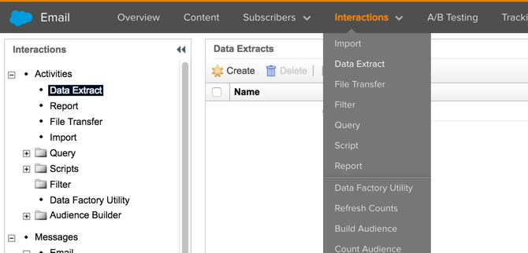

Fill the form and click `Save`.  Repeat twice more.

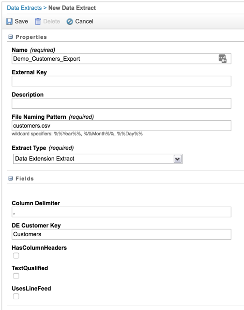

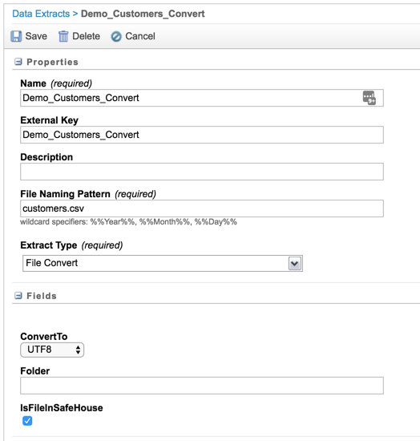

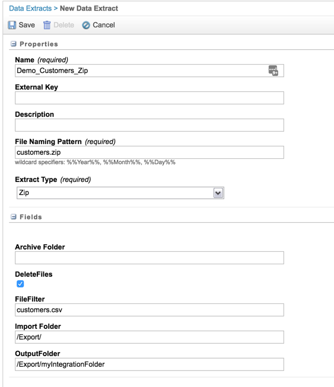

The output is three data exports: `Demo_Customers_Convert`, `Demo_Customers_Export`, `Demo_Customers_Zip`.

Navigate to `File Transfers` and click `Create`

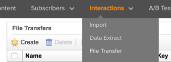

Fill the form and click `Save`.

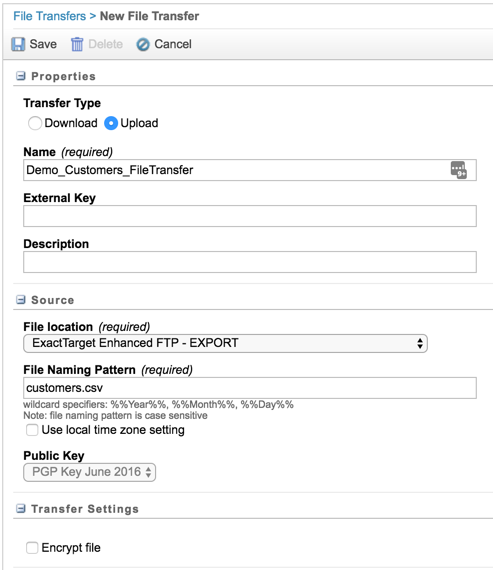

Navigate to Automation Studio

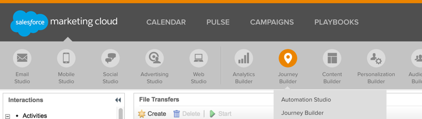

Create a new Scheduled Automation

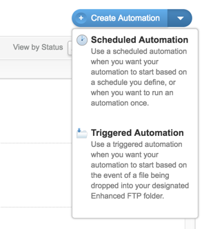

Switch to `Workflow` tab and select `Activities` from the toolbox on the right and drop them into the working area.

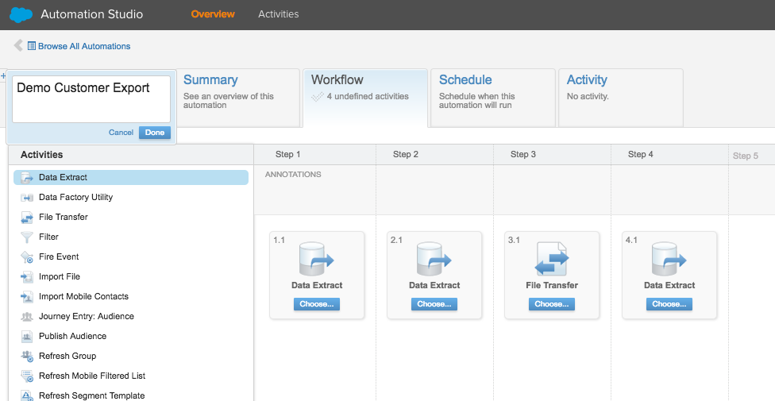

For each step click `Choose` and pick activity created earlier.
* Step 1 - `Demo_Customers_Convert`,
* Step 2 - `Demo_Customers_Export`,
* Step 3 - `Demo_Customers_FileTransfer`,
* Step 4 - `Demo_Customers_Zip`.

Save and click `Run Once` to verify that Automation is working.  File will be moved to an ftp location.

### Heroku App setup

Once the file is posted to FTP it can be loaded and copied to PostgreSQL.

Typically Export/Import jobs are run as [one off dynos](https://devcenter.heroku.com/articles/one-off-dynos) via [scheduled jobs](https://devcenter.heroku.com/articles/scheduler).

* Ensure pg connection string is set in `/src/script/load_data.ts`
* Ensure sftp credentials are set in `/src/lib/fileManager.ts`
* Variables in `src/script/load_data.ts`:
  * `pgConnectionString` - to store PG connection string
  * `sourceFileName` - to store file name in sftp folder
  * `sourceFilePath` - to store file path on sftp
* changes to `src/script/load_data.sh`
  * `_TableName` - schema.table_name value where to load data
  * `_TableFields` - comma separated list of fields which should match columns in the csv file.

* run `grunt default-watch` to compile TypeScript

### Running Job

* Once the app is compiled, execute `node /build/script/load_data.js` to run it.


## From Heroku to Marketing Cloud

Heroku push to Marketing Cloud is done in two steps:
 * exporting PG table to zip file and uploading it to Marketing Cloud
 * starting Automation Studio trigger and loading data to DataExtention

### Heroku App setup

* Ensure pg connection string is set in `/src/script/export_data.ts`
* Ensure sftp credentials are set in `/src/lib/fileManager.ts`
* variables in `src/script/export_data.ts`:
  * `pgConnectionString` - to store PG connection string
  * `sourceFileName` - to store file name that will be uploaded to ftp folder
  * `destinationFileZipPath` - to store file path on ftp

* changes to `src/script/export_data.sh`
  * `_SQL` - sql query that generates data for export

* run `grunt default-watch` to compile TypeScript


### Marketing Cloud setup

Make sure your Marketing Cloud account is provisioned with Mail, Automation Studio and Enhanced FTP.

Navigate to Email app.


Navigate to Admin and then click on Data Management on the right side -> File Locations.  We will create/find location from where Marketing Cloud will load exported file from Heroku.


Find/Create location where `Location Type` is Enhanced FTP Site Import Directory

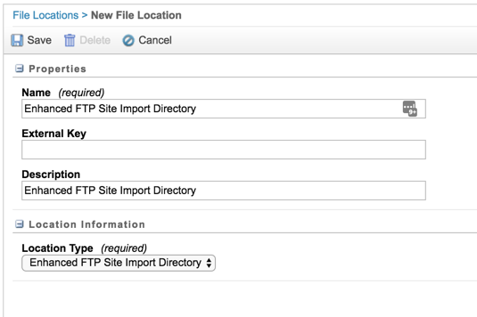

In top menu pick Interactions -> File Transfer and then click on Create


Fill the form.

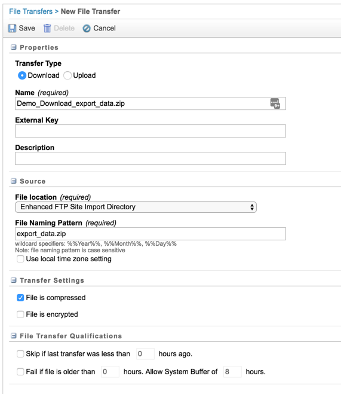

Navigate to Interactions->Import and then click Create

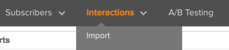

Fill the form

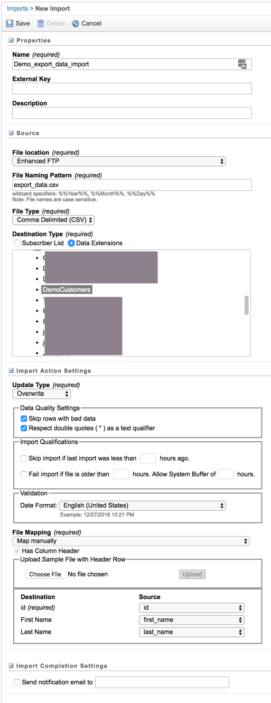

Navigate to Automation Studio


Create a new Triggered Automation


In the newly loaded window switch to Workflow tab and click on `Trigger Setup`

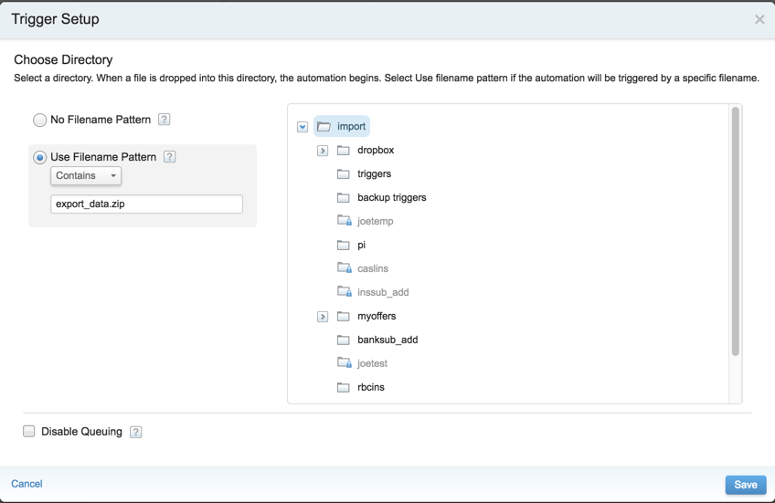

Then select Activities from the toolbox on the right and drop them into the working area.


For each step slick on 'Choose' and pick activity created earlier.
* Step1 - `Demo_Download_export_data.zip`,
* Step2 - `Demo_export_data_import`,

Save and make sure it's active.

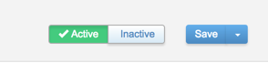


### Running Job

* now your Automation is set and you can send the file from Heroku to Marketing Cloud.  Execute `node /build/script/export_data.js` to run it.


## Troubleshooting

#### Typescript error 1

If you run into the following error:

```
	typings/globals/require/index.d.ts(367,13): error TS2403: Subsequent variable declarations must have the same type.  Variable 'require' must be of type 'NodeRequire', but here has type 'Require'.

	>> 1 non-emit-preventing type warning
	>> Error: tsc return code: 2
	Warning: Task "ts:app" failed. Use --force to continue.

	Aborted due to warnings.
```

screenshot:
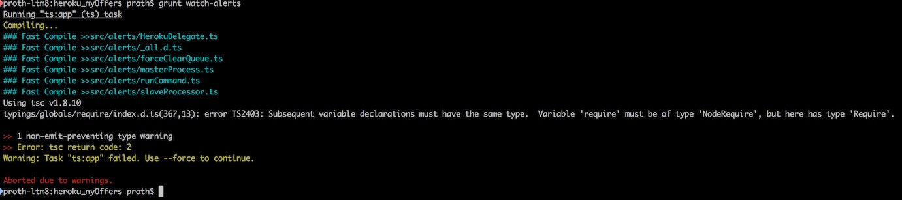

###### Resolution

The issue is due to the module at "globals/require/index.d.ts"
It appears that it is using Require instead of 'require'.

To fix this, remove the following line, from `typings/index.d.s`

	/// <reference path="globals/require/index.d.ts" />

#### Cannot read property 'setUp' of null

If you run into the following error:

```
	not ok 1 - TypeError: Cannot read property 'setUp' of null
	  ---
	  at:
	    line: 285
	    column: 14
	    file: node_modules/nodeunit/lib/core.js
	    function: wrapGroup
	  stack: |
	    wrapGroup (node_modules/nodeunit/lib/core.js:285:14)
	    wrapGroup (node_modules/nodeunit/lib/core.js:306:24)
	    Object.exports.runModule (node_modules/nodeunit/lib/core.js:146:11)
	    node_modules/nodeunit/lib/nodeunit.js:75:21
	    node_modules/nodeunit/deps/async.js:513:13
	    iterate (node_modules/nodeunit/deps/async.js:123:13)
	    node_modules/nodeunit/deps/async.js:134:25
	    node_modules/nodeunit/deps/async.js:515:17
	    node_modules/nodeunit/lib/core.js:165:9
	    node_modules/nodeunit/deps/async.js:518:13
	    async.forEachSeries (node_modules/nodeunit/deps/async.js:119:20)
	    _concat (node_modules/nodeunit/deps/async.js:512:9)
	    Object.concatSeries (node_modules/nodeunit/deps/async.js:152:23)
	    Object.exports.runSuite (node_modules/nodeunit/lib/core.js:96:11)
	    Object.exports.runModule (node_modules/nodeunit/lib/core.js:158:13)
	    node_modules/nodeunit/lib/nodeunit.js:75:21
	  test: TAP
	  message: 'TypeError: Cannot read property ''setUp'' of null'
	  source: |
	    if (group.setUp) {
```
###### Resolution

The issue is due to a missing null check in the nodeunit core.js file.

The issue is likely because a property was assigned null on the exports of the unit test somehow.

You can likely only find out which one it is by adding the following line at:
/usr/local/lib/node_modules/nodeunit/lib/core.js before of the line 285

	//Added line
	if(!group) return;

See here for more information:
[https://github.com/caolan/nodeunit/issues/198](https://github.com/caolan/nodeunit/issues/198)

Contributors
------------
<table id="contributors"><tr><td><a href="https://github.com/paulroth3d">paulroth3d</a></td><td><a href="https://github.com/JesseDavid">JesseDavid</a></td><td><a href="https://github.com/cherchyk">cherchyk</a></td></tr></table>
